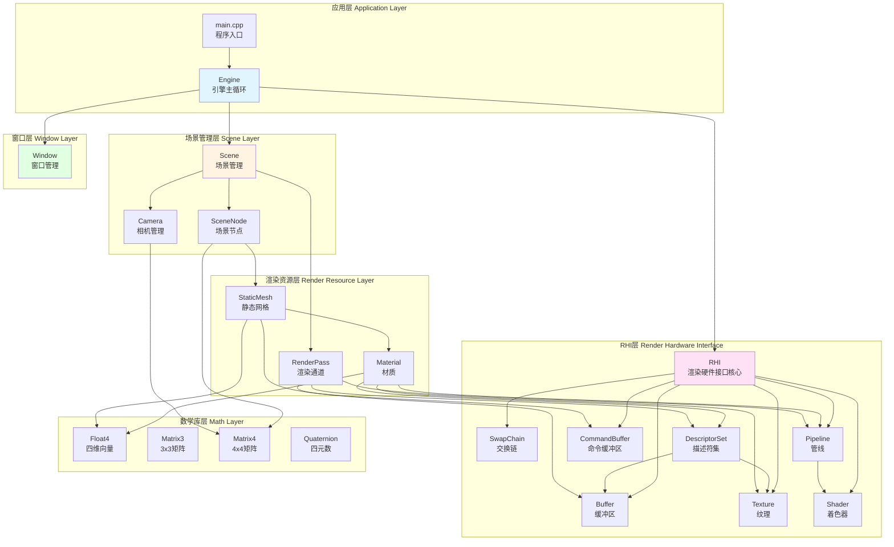
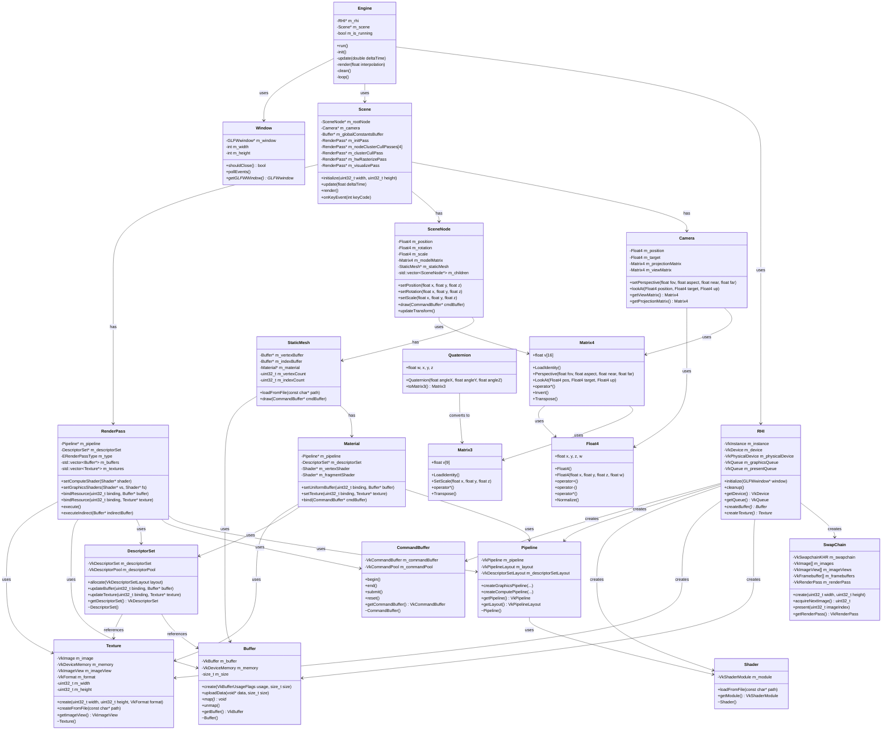
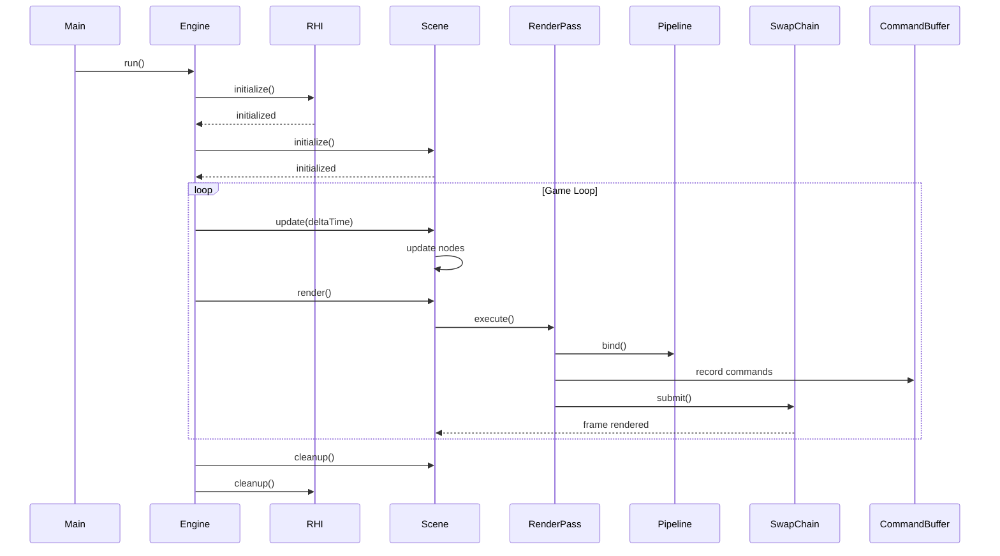
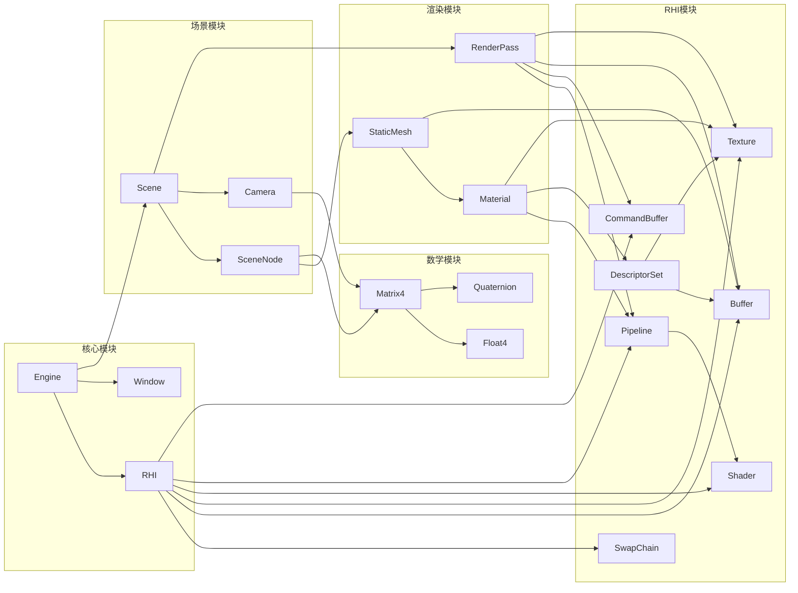

# Nano 架构设计图

## 系统架构图

```mermaid
graph TB
    subgraph "应用层 Application Layer"
        Engine[Engine<br/>引擎主循环]
        Main[main.cpp<br/>程序入口]
    end
    
    subgraph "场景管理层 Scene Layer"
        Scene[Scene<br/>场景管理]
        SceneNode[SceneNode<br/>场景节点]
        Camera[Camera<br/>相机管理]
    end
    
    subgraph "渲染资源层 Render Resource Layer"
        Material[Material<br/>材质]
        StaticMesh[StaticMesh<br/>静态网格]
        RenderPass[RenderPass<br/>渲染通道]
    end
    
    subgraph "RHI层 Render Hardware Interface"
        RHICore[RHI<br/>渲染硬件接口核心]
        SwapChain[SwapChain<br/>交换链]
        Buffer[Buffer<br/>缓冲区]
        Texture[Texture<br/>纹理]
        Shader[Shader<br/>着色器]
        Pipeline[Pipeline<br/>管线]
        CommandBuffer[CommandBuffer<br/>命令缓冲区]
        DescriptorSet[DescriptorSet<br/>描述符集]
    end
    
    subgraph "数学库层 Math Layer"
        Float4[Float4<br/>四维向量]
        Matrix3[Matrix3<br/>3x3矩阵]
        Matrix4[Matrix4<br/>4x4矩阵]
        Quaternion[Quaternion<br/>四元数]
    end
    
    subgraph "窗口层 Window Layer"
        Window[Window<br/>窗口管理]
    end
    
    Main --> Engine
    Engine --> Window
    Engine --> RHICore
    Engine --> Scene
    
    Scene --> Camera
    Scene --> SceneNode
    Scene --> RenderPass
    
    SceneNode --> StaticMesh
    StaticMesh --> Material
    
    RenderPass --> Pipeline
    RenderPass --> CommandBuffer
    RenderPass --> DescriptorSet
    
    Material --> Pipeline
    Material --> DescriptorSet
    Material --> Texture
    
    StaticMesh --> Buffer
    
    Pipeline --> Shader
    DescriptorSet --> Buffer
    DescriptorSet --> Texture
    
    RHICore --> SwapChain
    RHICore --> Buffer
    RHICore --> Texture
    RHICore --> Shader
    RHICore --> Pipeline
    RHICore --> CommandBuffer
    
    Camera --> Matrix4
    SceneNode --> Matrix4
    StaticMesh --> Float4
    Material --> Float4
    
    style Engine fill:#e1f5ff
    style Scene fill:#fff4e1
    style RHICore fill:#ffe1f5
    style Window fill:#e1ffe1
```

## UML 类图

```mermaid
classDiagram
    class Engine {
        -RHI* m_rhi
        -Scene* m_scene
        -bool m_is_running
        +run()
        -init()
        -update(double deltaTime)
        -render(float interpolation)
        -clean()
        -loop()
    }
    
    class RHI {
        -VkInstance m_instance
        -VkDevice m_device
        -VkPhysicalDevice m_physicalDevice
        -VkQueue m_graphicsQueue
        -VkQueue m_presentQueue
        +initialize(GLFWwindow* window)
        +cleanup()
        +getDevice() VkDevice
        +getQueue() VkQueue
        +createBuffer() Buffer*
        +createTexture() Texture*
    }
    
    class SwapChain {
        -VkSwapchainKHR m_swapchain
        -VkImage[] m_images
        -VkImageView[] m_imageViews
        -VkFramebuffer[] m_framebuffers
        -VkRenderPass m_renderPass
        +create(uint32_t width, uint32_t height)
        +acquireNextImage() uint32_t
        +present(uint32_t imageIndex)
        +getRenderPass() VkRenderPass
    }
    
    class Buffer {
        -VkBuffer m_buffer
        -VkDeviceMemory m_memory
        -size_t m_size
        +create(VkBufferUsageFlags usage, size_t size)
        +uploadData(void* data, size_t size)
        +map() void*
        +unmap()
        +getBuffer() VkBuffer
        ~Buffer()
    }
    
    class Texture {
        -VkImage m_image
        -VkDeviceMemory m_memory
        -VkImageView m_imageView
        -VkFormat m_format
        -uint32_t m_width
        -uint32_t m_height
        +create(uint32_t width, uint32_t height, VkFormat format)
        +createFromFile(const char* path)
        +getImageView() VkImageView
        ~Texture()
    }
    
    class Shader {
        -VkShaderModule m_module
        +loadFromFile(const char* path)
        +getModule() VkShaderModule
        ~Shader()
    }
    
    class Pipeline {
        -VkPipeline m_pipeline
        -VkPipelineLayout m_layout
        -VkDescriptorSetLayout m_descriptorSetLayout
        +createGraphicsPipeline(...)
        +createComputePipeline(...)
        +getPipeline() VkPipeline
        +getLayout() VkPipelineLayout
        ~Pipeline()
    }
    
    class CommandBuffer {
        -VkCommandBuffer m_commandBuffer
        -VkCommandPool m_commandPool
        +begin()
        +end()
        +submit()
        +reset()
        +getCommandBuffer() VkCommandBuffer
        ~CommandBuffer()
    }
    
    class DescriptorSet {
        -VkDescriptorSet m_descriptorSet
        -VkDescriptorPool m_descriptorPool
        +allocate(VkDescriptorSetLayout layout)
        +updateBuffer(uint32_t binding, Buffer* buffer)
        +updateTexture(uint32_t binding, Texture* texture)
        +getDescriptorSet() VkDescriptorSet
        ~DescriptorSet()
    }
    
    class Scene {
        -SceneNode* m_rootNode
        -Camera* m_camera
        -Buffer* m_globalConstantsBuffer
        -RenderPass* m_initPass
        -RenderPass* m_nodeClusterCullPasses[4]
        -RenderPass* m_clusterCullPass
        -RenderPass* m_hwRasterizePass
        -RenderPass* m_visualizePass
        +initialize(uint32_t width, uint32_t height)
        +update(float deltaTime)
        +render()
        +onKeyEvent(int keyCode)
    }
    
    class Camera {
        -Float4 m_position
        -Float4 m_target
        -Matrix4 m_projectionMatrix
        -Matrix4 m_viewMatrix
        +setPerspective(float fov, float aspect, float near, float far)
        +lookAt(Float4 position, Float4 target, Float4 up)
        +getViewMatrix() Matrix4
        +getProjectionMatrix() Matrix4
    }
    
    class SceneNode {
        -Float4 m_position
        -Float4 m_rotation
        -Float4 m_scale
        -Matrix4 m_modelMatrix
        -StaticMesh* m_staticMesh
        -std::vector~SceneNode*~ m_children
        +setPosition(float x, float y, float z)
        +setRotation(float x, float y, float z)
        +setScale(float x, float y, float z)
        +draw(CommandBuffer* cmdBuffer)
        +updateTransform()
    }
    
    class Material {
        -Pipeline* m_pipeline
        -DescriptorSet* m_descriptorSet
        -Shader* m_vertexShader
        -Shader* m_fragmentShader
        +setUniformBuffer(uint32_t binding, Buffer* buffer)
        +setTexture(uint32_t binding, Texture* texture)
        +bind(CommandBuffer* cmdBuffer)
    }
    
    class StaticMesh {
        -Buffer* m_vertexBuffer
        -Buffer* m_indexBuffer
        -Material* m_material
        -uint32_t m_vertexCount
        -uint32_t m_indexCount
        +loadFromFile(const char* path)
        +draw(CommandBuffer* cmdBuffer)
    }
    
    class RenderPass {
        -Pipeline* m_pipeline
        -DescriptorSet* m_descriptorSet
        -ERenderPassType m_type
        -std::vector~Buffer*~ m_buffers
        -std::vector~Texture*~ m_textures
        +setComputeShader(Shader* shader)
        +setGraphicsShaders(Shader* vs, Shader* fs)
        +bindResource(uint32_t binding, Buffer* buffer)
        +bindResource(uint32_t binding, Texture* texture)
        +execute()
        +executeIndirect(Buffer* indirectBuffer)
    }
    
    class Float4 {
        +float x, y, z, w
        +Float4()
        +Float4(float x, float y, float z, float w)
        +operator+()
        +operator-()
        +operator*()
        +Normalize()
    }
    
    class Matrix4 {
        +float v[16]
        +LoadIdentity()
        +Perspective(float fov, float aspect, float near, float far)
        +LookAt(Float4 pos, Float4 target, Float4 up)
        +operator*()
        +Invert()
        +Transpose()
    }
    
    class Matrix3 {
        +float v[9]
        +LoadIdentity()
        +SetScale(float x, float y, float z)
        +operator*()
        +Transpose()
    }
    
    class Quaternion {
        +float w, x, y, z
        +Quaternion(float angleX, float angleY, float angleZ)
        +toMatrix3() Matrix3
    }
    
    class Window {
        -GLFWwindow* m_window
        -int m_width
        -int m_height
        +shouldClose() bool
        +pollEvents()
        +getGLFWWindow() GLFWwindow*
    }
    
    Engine --> RHI : uses
    Engine --> Scene : uses
    Engine --> Window : uses
    
    Scene --> Camera : has
    Scene --> SceneNode : has
    Scene --> RenderPass : has
    
    SceneNode --> StaticMesh : has
    SceneNode --> Matrix4 : uses
    
    StaticMesh --> Material : has
    StaticMesh --> Buffer : uses
    
    Material --> Pipeline : uses
    Material --> DescriptorSet : uses
    Material --> Texture : uses
    
    RenderPass --> Pipeline : uses
    RenderPass --> CommandBuffer : uses
    RenderPass --> DescriptorSet : uses
    RenderPass --> Buffer : uses
    RenderPass --> Texture : uses
    
    RHI --> SwapChain : creates
    RHI --> Buffer : creates
    RHI --> Texture : creates
    RHI --> Shader : creates
    RHI --> Pipeline : creates
    RHI --> CommandBuffer : creates
    
    Pipeline --> Shader : uses
    DescriptorSet --> Buffer : references
    DescriptorSet --> Texture : references
    
    Camera --> Matrix4 : uses
    Camera --> Float4 : uses
    
    Matrix4 --> Matrix3 : uses
    Matrix4 --> Float4 : uses
    Quaternion --> Matrix3 : converts to
```

## 数据流图

```mermaid
sequenceDiagram
    participant Main
    participant Engine
    participant RHI
    participant Scene
    participant RenderPass
    participant Pipeline
    participant SwapChain
    
    Main->>Engine: run()
    Engine->>RHI: initialize()
    RHI-->>Engine: initialized
    Engine->>Scene: initialize()
    Scene-->>Engine: initialized
    
    loop Game Loop
        Engine->>Scene: update(deltaTime)
        Scene->>Scene: update nodes
        
        Engine->>Scene: render()
        Scene->>RenderPass: execute()
        RenderPass->>Pipeline: bind()
        RenderPass->>CommandBuffer: record commands
        RenderPass->>SwapChain: submit()
        SwapChain-->>Scene: frame rendered
    end
    
    Engine->>Scene: cleanup()
    Engine->>RHI: cleanup()
```

## 模块依赖关系图

```mermaid
graph LR
    subgraph "核心模块"
        A[Engine]
        B[RHI]
        C[Window]
    end
    
    subgraph "场景模块"
        D[Scene]
        E[SceneNode]
        F[Camera]
    end
    
    subgraph "渲染模块"
        G[Material]
        H[StaticMesh]
        I[RenderPass]
    end
    
    subgraph "RHI模块"
        J[SwapChain]
        K[Buffer]
        L[Texture]
        M[Shader]
        N[Pipeline]
        O[CommandBuffer]
        P[DescriptorSet]
    end
    
    subgraph "数学模块"
        Q[Float4]
        R[Matrix4]
        S[Quaternion]
    end
    
    A --> B
    A --> C
    A --> D
    
    D --> E
    D --> F
    D --> I
    
    E --> H
    H --> G
    I --> N
    I --> O
    
    G --> N
    G --> P
    G --> L
    
    H --> K
    I --> K
    I --> L
    
    B --> J
    B --> K
    B --> L
    B --> M
    B --> N
    B --> O
    
    N --> M
    P --> K
    P --> L
    
    F --> R
    E --> R
    R --> Q
    R --> S
```
