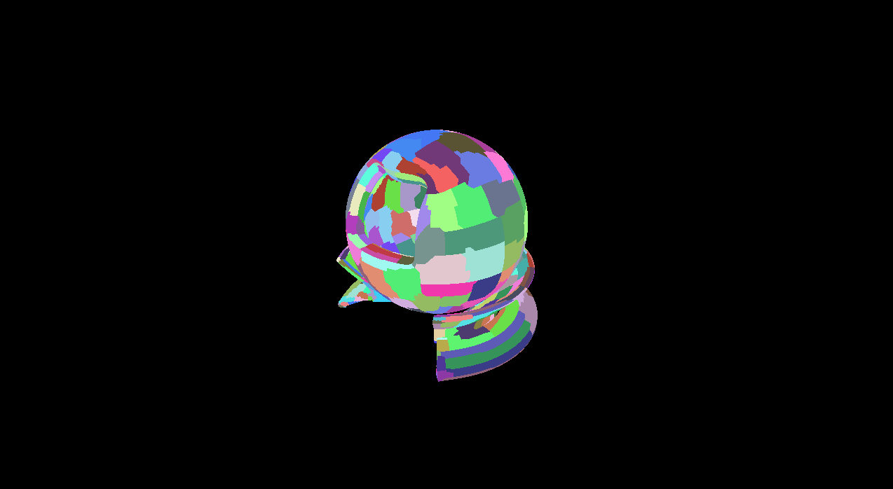

# Nano

A Vulkan-based virtual geometry system inspired by UE5 Nanite.

Implements BVH-based LOD selection, cluster culling, hardware rasterization with VisBuffer, and per-cluster visualization.

LOD 0:


LOD 3:


## Build

```bash
# Import git submodules
git submodule update --init --recursive

# Compile shaders
cd shaders && chmod +x compile.sh && ./compile.sh && cd ..

# Build
cmake -B build -DCMAKE_C_COMPILER=clang -DCMAKE_CXX_COMPILER=clang++
cmake --build build
```

## Run

```bash
cd bin && ./Nano
```

**Camera (FPS):** move **W A S D**, look with **mouse** (cursor captured). **Space** up, **Left Ctrl** down. **Esc** release / recapture mouse. **M** toggles **automatic distance LOD** vs **manual** LOD; in manual mode use **Up/Down** to pick mip (same discrete values as before).

LOD auto mode uses distance from the camera to the reference point `(0, 80, 0)` (roughly the old look target) to pick among the mesh’s stored mip levels. While the camera moves or turns, **HZB occlusion is disabled** for that frame so the previous-frame depth pyramid does not incorrectly cull geometry.

## Dependencies

- CMake 3.22+
- C++17 (Clang recommended, MSVC not supported)
- Vulkan SDK 1.2+
- GLFW, glslc (from Vulkan SDK)
- Assimp and meshoptimizer (git submodules in libs/)

## Project Structure

```
src/
  main.cpp              - GLFW window + main loop
  math/                 - Custom math library (float4, matrix4, quaternion)
  render/               - Vulkan RHI, render passes, materials, meshes
  scene/                - Scene management and node hierarchy
  exporter/             - Nanite BVH & NaniteMesh exporter (FBX, GLTF/GLB)
shaders/                - GLSL compute and graphics shaders
res/                    - Runtime assets (BVH, Nanite mesh data)
libs/                   - Third-party libraries (GLFW, GLM, ImGui, spdlog, stb)
```

## Rendering Pipeline

1. **Init** (Compute) - Clear VisBuffer64, initialize work arguments
2. **NodeAndClusterCull** (Compute x4) - BVH traversal, collect visible clusters by LOD
3. **ClusterCull** (Compute) - Copy visible clusters to output buffer
4. **HWRasterize** (Graphics, Indirect) - Rasterize clusters, write depth+clusterID to VisBuffer64 via atomicMin
5. **Visualize** (Compute) - Convert VisBuffer64 cluster IDs to colors via MurmurHash
6. **BuildHZB** (Compute) - Mip0 from VisBuffer64 depth, then max-reduction mips (previous-frame occlusion pyramid for step 2)
7. **SwapChain** (Graphics) - Blit visualization texture to screen

`GlobalConstants.mMisc0`: **x** = LOD mip (auto distance or manual), **y** = HZB occlusion (0 first frame / camera moved / warmup, 1 when previous-frame HZB is valid), **z/w** = screen size for projection tests.

## Exporter

Export FBX or GLTF/GLB models to BVH and NaniteMesh for use with Nano:

```bash
./bin/NaniteExporter --input model.fbx --out-bvh res/model.bvh --out-nanitemesh res/model.nanitemesh
```

Optional: `--mip-values "0,1,2,3,4,5,6,7,8,10"`, `--triangles-per-cluster 128`, `--index-count 384`, `--target-extent 500`.

## TODO

1. Using Multithreading for BVH traversal and other tasks.
